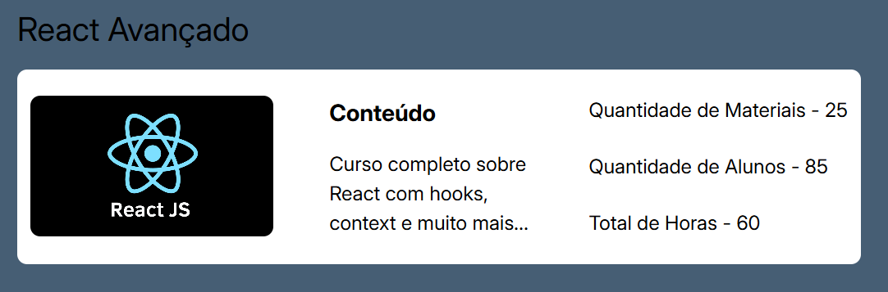

# 📚 Class

Um componente de card de curso React para exibir informações detalhadas sobre cursos no projeto Gratitude Capacita.

## 💡 Uso Básico

```jsx
<Class
  title="Introdução ao React"
  image="/curso-react.jpg"
  imageDescription="Imagem do curso de React"
  description="Aprenda os fundamentos do React..."
  materials="15"
  students="120"
  hours="40"
/>
```

## 📝 Props

| Prop               | Tipo     | Padrão | Obrigatório | Descrição                        |
| ------------------ | -------- | ------ | ----------- | -------------------------------- |
| `title`            | `string` | `""`   | ✅          | Título do curso                  |
| `image`            | `string` | `""`   | ✅          | URL da imagem do curso           |
| `imageDescription` | `string` | `""`   | ❌          | Texto alternativo para a imagem  |
| `description`      | `string` | `""`   | ✅          | Descrição detalhada do curso     |
| `materials`        | `string` | `""`   | ✅          | Quantidade de materiais do curso |
| `students`         | `string` | `""`   | ✅          | Número de alunos matriculados    |
| `hours`            | `string` | `""`   | ✅          | Total de horas do curso          |

## 🎨 Exemplo Visual
<div align="center">
  
</div>

```jsx
<Class
  title="React Avançado"
  image="https://miro.medium.com/v2/resize:fit:2000/0*zj_kGMq6f2ZxW7p3.png"
  imageDescription="Logo React"
  description="Curso completo sobre React com hooks, context e muito mais..."
  materials="25"
  students="85"
  hours="60"
/>
```


## 🧩 Estrutura Interna

### Seção de Conteúdo

- **Título:** Exibido como h3
- **Descrição:** Texto detalhado sobre o curso

### Seção de Informações

- Quantidade de Materiais
- Quantidade de Alunos
- Total de Horas