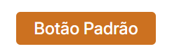
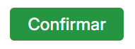
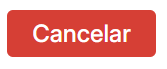
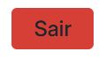

# 🔘 Button

Um componente de botão React reutilizável e personalizável para o projeto Gratitude Capacita.

## 💡 Uso Básico

```jsx
<Button
  label="Clique aqui"
  variant="Default"
  onClick={() => console.log("Botão clicado!")}
/>
```

## 📝 Props

| Prop      | Tipo       | Padrão    | Obrigatório | Descrição                           |
| --------- | ---------- | --------- | ----------- | ----------------------------------- |
| `label`   | `string`   | `""`      | ✅          | Texto exibido no botão              |
| `variant` | `string`   | `Default` | ❌          | Estilo visual do botão              |
| `rounded` | `boolean`  | `false`   | ❌          | Define se o botão será redondo      |
| `onClick` | `function` | -         | ✅          | Função executada ao clicar no botão |

## 🎨 Variantes

### Default

<table>
<tr>
<td width="50%">

<div align="center">
  
</div>

</td>
<td width="50%">

```jsx
<Button label="Botão Padrão" variant="Default" />
```

</td>
</tr>
</table>

- **Cor:** `#CC7120`
- **Uso:** Ações gerais

### Confirm

<table>
<tr>
<td width="50%">

<div align="center">
  
</div>

</td>
<td width="50%">

```jsx
<Button label="Confirmar" variant="Confirm" />
```

</td>
</tr>
</table>

- **Cor:** `#269542`
- **Uso:** Confirmações e ações positivas

### Cancel

<table>
<tr>

<td width="50%">
<div align="center">
  
</div>
</td>

<td width="50%">

```jsx
<Button label="Cancelar" variant="Cancel" />
```
</td>
</tr>
</table>

- **Cor:** `#D63F35`
- **Uso:** Cancelamentos e ações destrutivas

### Exit

<table>
<tr>
<td width="50%">

<div align="center">
  
</div>

</td>
<td width="50%">

```jsx
<Button label="Sair" variant="Exit" />
```

</td>
</tr>
</table>

- **Cor:** `#D63F35` com texto `#1D262D`
- **Uso:** Logout e saída do sistema
