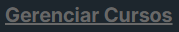

# 🔗 Link

Um componente de link React reutilizável e personalizável para o projeto Gratitude Capacita.

## 💡 Uso Básico

```jsx
<Link text="Clique aqui" redirectUrl="https://example.com" />
```

## 📝 Props

| Prop          | Tipo     | Padrão | Obrigatório | Descrição                             |
| ------------- | -------- | ------ | ----------- | ------------------------------------- |
| `text`        | `string` | `""`   | ✅          | Texto exibido no link                 |
| `redirect` | `string` | `""`   | ✅          | Rota para onde o link vai redirecionar |

## 🎨 Exemplo Visual

<table>
<tr>
<td width="50%">

```jsx
<Link text="Gerenciar Cursos" redirect="/cursos" />
```

</td>
<td width="50%">

<div align="center">
  
</div>

<div align="center">
  
</div>

</td>
</tr>
</table>
