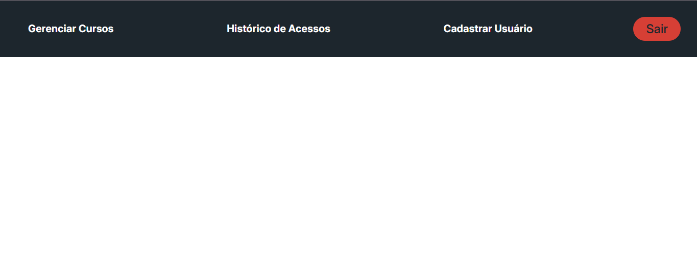

# 🎯 Header

Um componente de cabeçalho React fixo para navegação principal do projeto Gratitude Capacita.

## 💡 Uso Básico

```jsx
<Header />
```
_Utilizado na raiz do projeto (main.jsx)_

## 📝 Props

Este componente não recebe props - ele renderiza uma navegação fixa com links e botão de logout. 

_OBS: Internamente, os componentes utilizados pelo `Header` necessitam de props_

## 🎨 Exemplo Visual

<div align="center">
  
</div>

```jsx
<Header />
```

## 🧩 Estrutura Interna

O Header contém os seguintes elementos:

### Links de Navegação

- Gerenciar Cursos
- Histórico de Acessos
- Cadastrar Usuário

### Botão de Ação

- **Sair** (variant="Exit", rounded)

## 📦 Componentes Utilizados

- [`Link`](Link.md) - Para navegação
- [`Button`](Button.md) - Para ação de logout